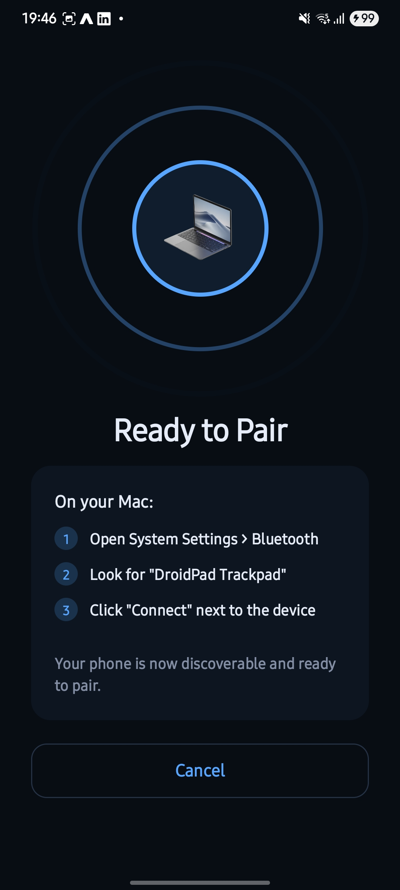
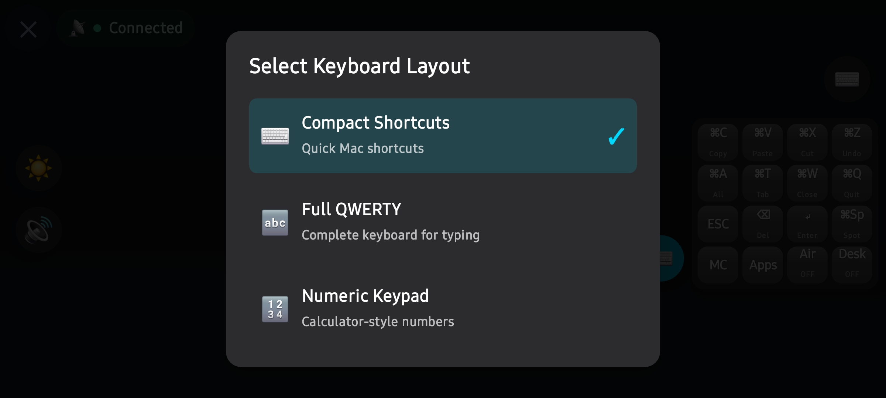
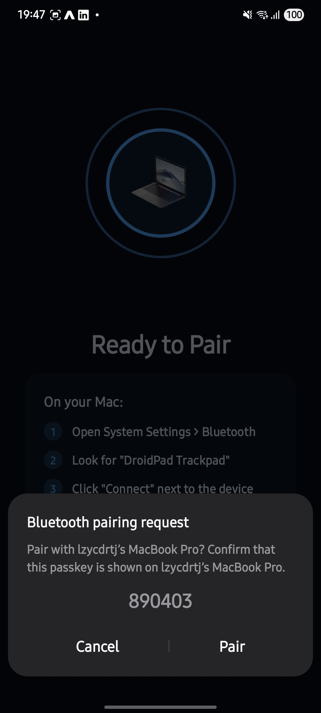
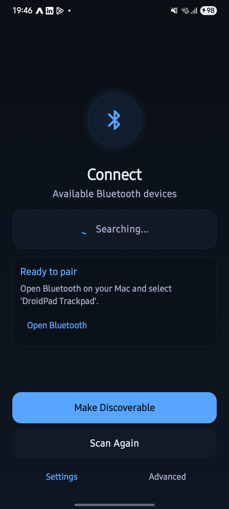
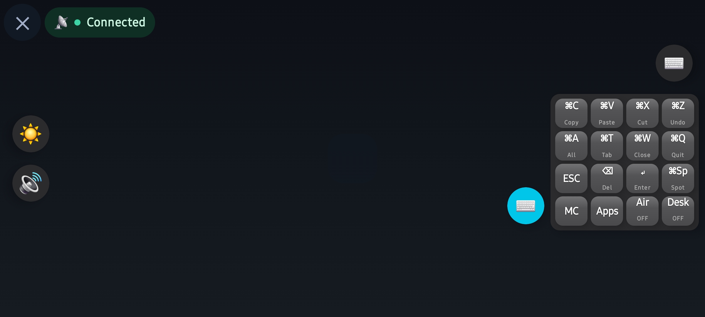
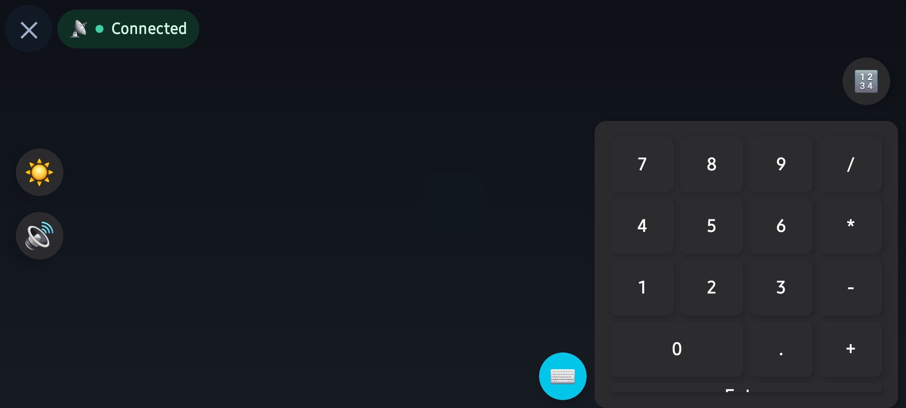

# DroidPad - Android Trackpad for macOS

<div align="center">

   

**Transform your Android device into a wireless trackpad and mouse for your Mac**

[Features](#-features) • [Installation](#-installation) • [Usage](#-usage) • [Building](#-building) • [Contributing](#-contributing)

</div>

---

## 📸 Screenshots

<div align="center">

| Android App | macOS Pairing |
|-------------|---------------|
|  |  |
| Main screen with device registration | macOS Bluetooth settings |

| Full-Screen Trackpad | Settings |
|---------------------|----------|
|  |  |
| Full-screen trackpad mode | Customizable settings |

</div>

---

## 📱 Overview

DroidPad is an Android application that enables your Android phone or tablet to function as a Bluetooth HID (Human Interface Device) trackpad and mouse for macOS. It provides a seamless, wireless control experience with support for multi-touch gestures, air mouse mode, and macOS-specific shortcuts.

### How It Works

DroidPad uses the standard Bluetooth HID protocol to register your Android device as a pointing device with macOS. Once paired, your Mac recognizes it as a standard trackpad, requiring no additional software installation on your Mac. The connection is direct and works immediately after the initial pairing process.

### Key Highlights

- 🎯 **Zero Configuration**: Works out of the box with standard Bluetooth HID protocol
- 🖱️ **Full Trackpad Experience**: Multi-touch gestures, scrolling, clicking, and more
- ✈️ **Air Mouse Mode**: Use your device's gyroscope for cursor control
- ⌨️ **macOS Shortcuts**: Built-in support for Mission Control, App Switcher, and Show Desktop
- 🔄 **Auto-Reconnect**: Automatically reconnects to previously paired devices
- 🎨 **Modern UI**: Beautiful, intuitive interface built with Jetpack Compose

---

## ✨ Features

### Core Functionality

- **Bluetooth HID Device**: Implements standard Bluetooth HID protocol for maximum compatibility
- **Touchpad Controls**:
  - Single finger drag for cursor movement
  - Single tap for left click
  - Two-finger tap for right click
  - Two-finger scroll (vertical)
  - Pinch-to-zoom gestures
  - Three-finger gestures for Mission Control and Show Desktop
  - Four-finger swipe for desktop switching

- **Air Mouse Mode**: 
  - Gyroscope-based cursor control
  - Tilt your device to move the cursor
  - Perfect for presentations or when you need hands-free control

- **macOS Integration**:
  - Mission Control (3-finger swipe up or button)
  - Show Desktop (3-finger swipe down or button)
  - App Switcher (Cmd+Tab via button)
  - Native macOS gesture support

- **Device Management**:
  - Recent devices list with quick reconnect
  - Auto-reconnect on app launch
  - Connection history tracking
  - Reset functionality for troubleshooting

- **User Experience**:
  - Full-screen trackpad mode
  - Visual touch feedback
  - Connection status indicators
  - Gesture hints and guides
  - Smooth animations and transitions

---

## 📋 Requirements

### Android Device
- **Minimum SDK**: Android 10 (API 29)
- **Target SDK**: Android 14 (API 36)
- **Bluetooth**: Bluetooth 4.0+ with HID support
- **Hardware**: 
  - Touchscreen (required)
  - Gyroscope (optional, for Air Mouse mode)

### macOS Computer
- macOS 10.12 (Sierra) or later
- Bluetooth 4.0+ support
- No additional software required

---

## 🚀 Installation

### Option 1: Download APK (Coming Soon)

1. Download the latest APK from the [Releases](https://github.com/Tolstoyj/MacTrack/releases) page
2. Enable "Install from Unknown Sources" on your Android device
3. Install the APK file
4. Grant Bluetooth permissions when prompted

### Option 2: Build from Source

See the [Building](#-building) section below.

---

## 📖 Usage

### First-Time Setup

#### Step 1: Launch the App
- Open DroidPad on your Android device
- Grant Bluetooth permissions if prompted
- Complete the onboarding process (battery optimization settings)


*Onboarding screen - First launch setup. Make sure to enable battery optimization exception for reliable background operation.*

#### Step 2: Register as HID Device
- Tap the **"Register"** button on the main screen
- Accept the Bluetooth discoverability request (typically 5 minutes)
- Wait for "Device Registered" status confirmation
- Your device will now appear as "DroidPad Trackpad" in Bluetooth searches


*Main screen - Tap "Register" to make your device discoverable as a trackpad. The status card shows registration state.*

#### Step 3: Pair with macOS
1. On your Mac, open **System Settings** (or System Preferences on older macOS)
2. Navigate to **Bluetooth** settings
3. Look for **"DroidPad Trackpad"** in the list of available devices
   - ⚠️ **Important**: Look for "DroidPad Trackpad", NOT your phone's actual name
4. Click **"Connect"** next to "DroidPad Trackpad"
5. Wait for connection confirmation - you should see it change to "Connected"


*macOS Bluetooth Settings - Look for "DroidPad Trackpad" in the list of devices. Make sure Bluetooth is enabled on your Mac.*


*macOS Bluetooth Pairing - Click "Connect" to pair with DroidPad Trackpad. The connection should complete within a few seconds.*

#### Step 4: Start Using
- Once connected, the app automatically enters full-screen trackpad mode
- You can now use your Android device to control your Mac's cursor
- Touch and drag on the screen to move the cursor
- Tap to click, use multi-finger gestures for scrolling and macOS shortcuts

#### ⚠️ Important Notes
- **If previously paired**: If your device was previously paired with your Mac (as a regular Bluetooth device), you **must** forget/unpair it first in Mac Bluetooth settings before pairing as "DroidPad Trackpad"
- **One device at a time**: Only one device can be connected as "DroidPad Trackpad" at a time
- **Auto-reconnect**: Once paired, the app will automatically attempt to reconnect on future launches

### Using the Trackpad

#### Main Screen
- **Trackpad Surface**: Touch and drag to move cursor
- **Status Card**: Shows current connection state
- **Register/Unregister**: Control HID device registration
- **Recent Devices**: Quick access to previously connected devices


*Main screen showing connection status and device registration*

#### Full-Screen Mode
Automatically launches when connected. Features:
- **Back Button** (✕): Return to main screen
- **Connection Indicator**: Shows connection status
- **Air Mouse Toggle**: Enable/disable gyroscope control
- **Quick Actions**: 
  - Mission Control button
  - App Switcher button
  - Show Desktop button


*Full-screen trackpad mode - Active trackpad with quick action buttons*


*Full-screen trackpad mode - Connected and ready to use*

### Gestures

| Gesture | Action |
|---------|--------|
| **1 Finger Drag** | Move cursor |
| **1 Finger Tap** | Left click |
| **2 Finger Tap** | Right click |
| **2 Finger Scroll** | Vertical scroll |
| **2 Finger Pinch** | Zoom in/out |
| **3 Finger Swipe Up** | Mission Control |
| **3 Finger Swipe Down** | Show Desktop |
| **4 Finger Swipe Left/Right** | Switch desktops |

### Air Mouse Mode

1. Connect to your Mac
2. Enter full-screen trackpad mode
3. Tap the Air Mouse button (📱) to enable
4. Tilt your device to move the cursor
5. Tap again to disable

### Settings

Access settings from the main screen or full-screen mode to customize:
- Pointer speed and sensitivity
- Scroll speed and direction
- Tap-to-click behavior
- Gesture guides
- Connection preferences


*Settings screen - Customize trackpad behavior and preferences*

### Troubleshooting

#### Connection Issues

1. **Device Not Appearing**
   - Ensure Bluetooth is enabled on both devices
   - Make sure the Android device is discoverable
   - Check that "DroidPad Trackpad" appears (not your phone name)

2. **Connection Fails**
   - Unpair the device from Mac Bluetooth settings
   - Use "Reset All Connections" in the app
   - Re-register and pair again

3. **Lag or Delayed Response**
   - Ensure devices are within Bluetooth range
   - Close other Bluetooth-intensive apps
   - Restart Bluetooth on both devices

4. **Gestures Not Working**
   - Verify connection status shows "Connected"
   - Try disconnecting and reconnecting
   - Check that full-screen mode is active

---

## 🔨 Building

### Prerequisites

- **Android Studio**: Hedgehog (2023.1.1) or later
- **JDK**: 11 or later
- **Gradle**: 8.0+ (included via wrapper)
- **Android SDK**: API 29+ (Android 10)

### Build Steps

1. **Clone the Repository**
   ```bash
   git clone https://github.com/Tolstoyj/MacTrack.git
   cd MacTrack
   ```

2. **Open in Android Studio**
   - Open Android Studio
   - Select "Open an Existing Project"
   - Navigate to the cloned directory

3. **Sync Gradle**
   - Android Studio will automatically sync Gradle dependencies
   - Wait for sync to complete

4. **Build the APK**
   ```bash
   ./gradlew assembleDebug
   ```
   The APK will be generated at: `app/build/outputs/apk/debug/app-debug.apk`

5. **Install on Device**
   ```bash
   ./gradlew installDebug
   ```
   Or use Android Studio's Run button

### Project Structure

```
DroidPadMacOS/
├── app/
│   ├── src/
│   │   └── main/
│   │       ├── java/com/dps/droidpadmacos/
│   │       │   ├── MainActivity.kt              # Main UI and setup
│   │       │   ├── FullScreenTrackpadActivity.kt # Full-screen trackpad
│   │       │   ├── bluetooth/
│   │       │   │   ├── BluetoothHidService.kt   # HID device management
│   │       │   │   └── HidConstants.kt         # HID descriptors
│   │       │   ├── touchpad/
│   │       │   │   ├── EnhancedGestureDetector.kt # Multi-touch gestures
│   │       │   │   └── TouchpadGestureDetector.kt # Basic gestures
│   │       │   ├── sensor/
│   │       │   │   └── AirMouseSensor.kt        # Gyroscope control
│   │       │   ├── viewmodel/
│   │       │   │   └── TrackpadViewModel.kt     # Business logic
│   │       │   ├── data/
│   │       │   │   └── DeviceHistoryManager.kt # Device persistence
│   │       │   └── ui/
│   │       │       ├── TrackpadSurface.kt       # Trackpad UI component
│   │       │       └── RecentDevicesList.kt     # Device list UI
│   │       └── res/                             # Resources
│   └── build.gradle.kts                         # App dependencies
├── build.gradle.kts                             # Project config
├── gradle/
│   └── libs.versions.toml                       # Version catalog
└── settings.gradle.kts                          # Project settings
```

### Key Dependencies

- **Jetpack Compose**: Modern declarative UI framework
- **Material 3**: Latest Material Design components
- **Kotlin Coroutines**: Asynchronous programming
- **AndroidX Lifecycle**: Lifecycle-aware components

---

## 🏗️ Architecture

DroidPad follows a clean architecture pattern:

- **UI Layer**: Jetpack Compose screens and components
- **ViewModel Layer**: Business logic and state management
- **Service Layer**: Bluetooth HID service (singleton)
- **Data Layer**: SharedPreferences for device history

### Key Components

1. **BluetoothHidService**: Manages HID device registration and communication
2. **TrackpadViewModel**: Coordinates between UI and services
3. **EnhancedGestureDetector**: Processes multi-touch gestures
4. **AirMouseSensor**: Handles gyroscope-based cursor control

---

## 🔧 Technical Details

### Bluetooth HID Implementation

DroidPad implements the Bluetooth HID specification to register as a standard input device:

- **SDP Record**: Defines device as combo keyboard+pointing device
- **HID Descriptors**: Standard mouse and keyboard descriptors
- **Report Protocol**: Uses report IDs for mouse and keyboard events
- **QoS Settings**: Optimized for low latency input

### HID Report Format

**Mouse Report** (Report ID 1):
```
[Buttons: 1 byte] [X: 1 byte] [Y: 1 byte] [Wheel: 1 byte]
```

**Keyboard Report** (Report ID 2):
```
[Modifiers: 1 byte] [Reserved: 1 byte] [Keys: 6 bytes]
```

### Gesture Detection

- Uses Android's `MotionEvent` API for touch tracking
- Supports up to 4 simultaneous touch points
- Implements velocity and distance thresholds for gesture recognition
- Configurable sensitivity settings

---

## 🤝 Contributing

Contributions are welcome! Please follow these guidelines:

### How to Contribute

1. **Fork the Repository**
   ```bash
   git clone https://github.com/YOUR_USERNAME/MacTrack.git
   ```

2. **Create a Feature Branch**
   ```bash
   git checkout -b feature/amazing-feature
   ```

3. **Make Your Changes**
   - Follow Kotlin coding conventions
   - Add comments for complex logic
   - Update documentation as needed

4. **Test Your Changes**
   - Test on multiple Android versions if possible
   - Verify Bluetooth connectivity
   - Test gesture recognition

5. **Commit Your Changes**
   ```bash
   git commit -m "Add amazing feature"
   ```

6. **Push and Create Pull Request**
   ```bash
   git push origin feature/amazing-feature
   ```

### Code Style

- Follow [Kotlin Coding Conventions](https://kotlinlang.org/docs/coding-conventions.html)
- Use meaningful variable and function names
- Add KDoc comments for public functions
- Keep functions focused and single-purpose

### Reporting Issues

When reporting issues, please include:
- Android version and device model
- macOS version
- Steps to reproduce
- Expected vs actual behavior
- Logs (if applicable)

---

## 📝 License

This project is licensed under the MIT License - see the [LICENSE](LICENSE) file for details.

---

## 🙏 Acknowledgments

- Built with [Jetpack Compose](https://developer.android.com/jetpack/compose)
- Uses Android's [Bluetooth HID API](https://developer.android.com/reference/android/bluetooth/BluetoothHidDevice)
- Inspired by the need for a wireless trackpad solution

---

## 📞 Support

- **Issues**: [GitHub Issues](https://github.com/Tolstoyj/MacTrack/issues)
- **Discussions**: [GitHub Discussions](https://github.com/Tolstoyj/MacTrack/discussions)

---

## 🗺️ Roadmap

- [ ] Customizable gesture sensitivity
- [ ] Additional macOS shortcuts
- [ ] Windows/Linux support
- [ ] Battery optimization improvements
- [ ] Dark mode theme
- [ ] Multi-device support
- [ ] Keyboard input support

---

<div align="center">

**Made with ❤️ for the open-source community**

⭐ Star this repo if you find it useful!

</div>

